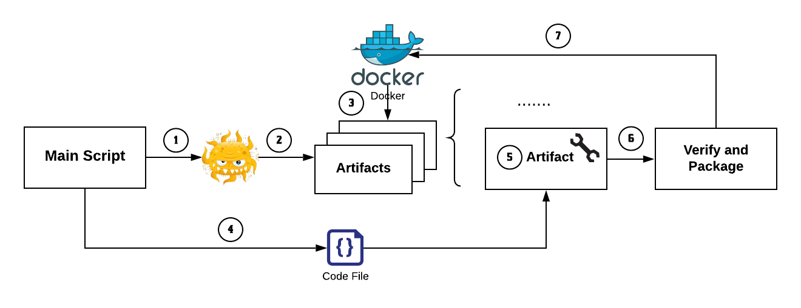

# Cache Dependency

## Overview

CacheDependency is a automated tool for caching BugSwarm artifacts' dependencies.
In following this README, we will run the tool to generate results and then evaluate those results.

## Requirements:
1. Docker Client
1. BugSwarm credential configured
1. Disk Space > 30 GB
1. Python >= 3.6


## Usage
```
python3 CacheMaven.py <image-tag-file> <task-name> [--copy-m2 | --copy-m2-aggressive]
python3 CachePython.py <image-tag-file> <task-name>
```

* `image_tags_file`: Path to a file containing a newline-separated list of image tags to process.
* `task-name`: Results will be put in `output/<task-name>.csv`. Docker containers names will start with `<task-name>-`.
* `--copy-m2`: Copy `~/.m2/failed/` and `~/.m2/passed/` to solve dirty workspace problem.
* `--copy-m2-aggressive`: Copy `~/.m2/` to solve dirty workspace problem.
* `--remove_maven_repositories`: Remove `_remote.repositories` and `_maven.repositories`.


## Output
Output files are placed in the `output` directory.

Each line in the output file follows this format:
```
image-tag, orginal-size, failed/succeed, increased-size
```

1. `image-tag`: The name of the image tag attempted to be cached.
2. `original-size`: The size of the original Docker image.
3. `succeed` if the artifact's dependencies were successfully cached using the given approach; `failed` otherwise.
    * If the script is unable to get the artifact data for a given image tag from the database, `API error` is written and the next two columns are blank.
    * If an error occurs while attempting to verfy and cache an artifact, `error` is written and the next two columns are blank.
4. `increased-size`: How much the artifact's Docker image increased in size after its dependencies were cached.
   If dependencies could not be cached, `-1`.
   
   
## Example
### Java
Create a file `image-tag-java` which contains `Adobe-Consulting-Services-acs-aem-commons-427338776`
Then run: 
```
python3 CacheMaven.py image-tag-java java-test
```

You should be able to see the result in `output/java-test.csv`.

### Python
Create a file `image-tag-python` which contains `Abjad-abjad-289716771`
Then run: 
```
python3 CachePython.py image-tag-python python-test
```

You should be able to see the result in `output/python-test.csv`

## Caching Details

### Maven build
1. Patched the configuration file to specify the maven cache path for passed and failed job.
1. Runs the failed and passed jobs using `run_failed.sh` and `run_passed.sh`, caching the dependencies in the process.
1. Add offline flag in the build script to utilize the local dependencies

### Python
1. Parse the original logs to get a list of dependencies and versions.
1. Based on python/pip version, we initiate a docker container with same `python version` to download packages via `pip download`.  
1. Copy them into the artifact(`failed/requirements/`, `passed/requirements/`).
1. Patch build script with `--no-index --find-link` to utilize the download dependencies. 


## Unit tests for log parser
```
cd tests
python3 -m test_python_log_parser
```
